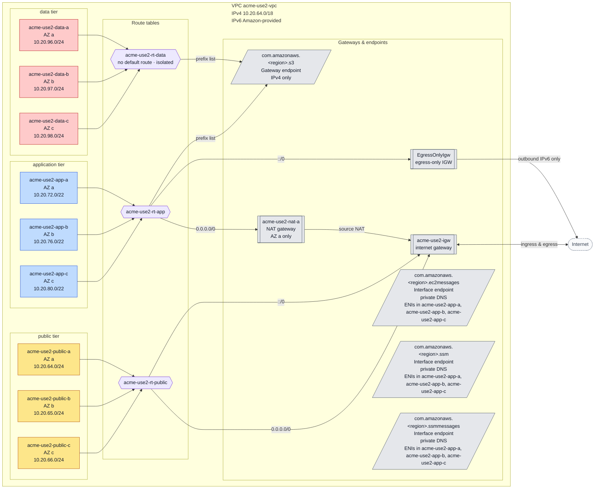
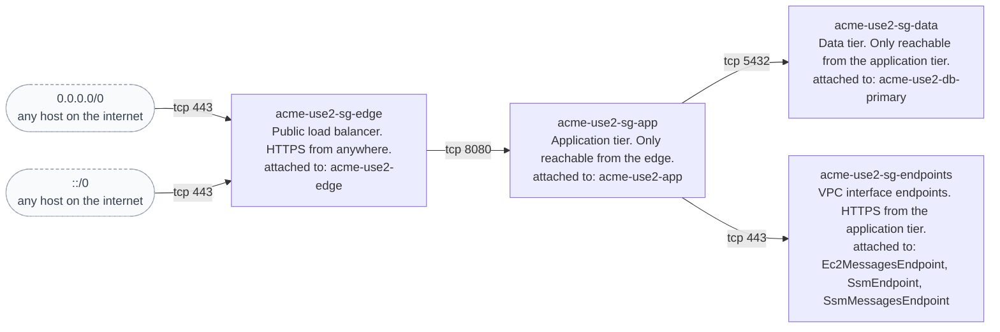
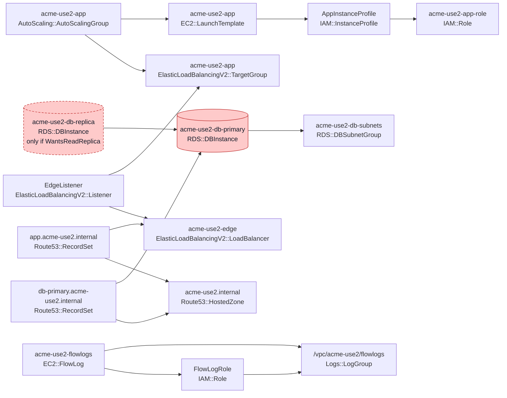

# Vpc Baseline — Architecture

<!-- generated by scripts/gen-arch-docs.py -- do not edit by hand -->

Generated from [`template.yaml`](./template.yaml) by [`scripts/gen-arch-docs.py`](../../scripts/gen-arch-docs.py). Edits here are overwritten on the next push — change the template instead.

> Baseline dual-stack VPC for the SecKC 2026 talk. This is a deliberately ordinary three-tier layout: public edge, private application tier, isolated data tier, across three availability zones. It exists so the architecture documentation demo has a real template to read and diagram.
>
> Nothing here is production. Addressing uses documentation ranges only.

## At a glance

| Property | Value |
|---|---|
| VPC CIDR | 10.20.64.0/18 |
| Resources | 56 |
| Resource types | 26 |
| Availability zones | 3 |
| Subnets | 9 |
| Tiers | application, data, public |
| Address family | dual-stack (IPv4 + IPv6) |
| Security groups | 4 |
| Parameters | 6 |
| Outputs | 12 |

## Diagrams

### Network topology and egress paths

### Security group reachability

### Component dependencies

Arrows point from a resource to the resources it references. Red cylinders hold state; dashed borders are conditional resources.

## Addressing

| Subnet | Tier | AZ | CIDR | Auto public IP | Route table | Default route |
|---|---|---|---|---|---|---|
| `acme-use2-public-a` | public | a | `10.20.64.0/24` | yes | `PublicRouteTable` | 0.0.0.0/0 → InternetGateway, ::/0 → InternetGateway |
| `acme-use2-public-b` | public | b | `10.20.65.0/24` | yes | `PublicRouteTable` | 0.0.0.0/0 → InternetGateway, ::/0 → InternetGateway |
| `acme-use2-public-c` | public | c | `10.20.66.0/24` | yes | `PublicRouteTable` | 0.0.0.0/0 → InternetGateway, ::/0 → InternetGateway |
| `acme-use2-app-a` | application | a | `10.20.72.0/22` | no | `AppRouteTable` | 0.0.0.0/0 → NatGateway, ::/0 → EgressOnlyIgw |
| `acme-use2-app-b` | application | b | `10.20.76.0/22` | no | `AppRouteTable` | 0.0.0.0/0 → NatGateway, ::/0 → EgressOnlyIgw |
| `acme-use2-app-c` | application | c | `10.20.80.0/22` | no | `AppRouteTable` | 0.0.0.0/0 → NatGateway, ::/0 → EgressOnlyIgw |
| `acme-use2-data-a` | data | a | `10.20.96.0/24` | no | `DataRouteTable` | none (isolated) |
| `acme-use2-data-b` | data | b | `10.20.97.0/24` | no | `DataRouteTable` | none (isolated) |
| `acme-use2-data-c` | data | c | `10.20.98.0/24` | no | `DataRouteTable` | none (isolated) |

## Routing

| Route table | Destination | Target | Target kind | Associated subnets |
|---|---|---|---|---|
| `AppRouteTable` | `0.0.0.0/0` | `NatGateway` | NatGateway | acme-use2-app-a, acme-use2-app-b, acme-use2-app-c |
| `AppRouteTable` | `::/0` | `EgressOnlyIgw` | EgressOnlyInternetGateway | acme-use2-app-a, acme-use2-app-b, acme-use2-app-c |
| `DataRouteTable` | — | — | local only | acme-use2-data-a, acme-use2-data-b, acme-use2-data-c |
| `PublicRouteTable` | `0.0.0.0/0` | `InternetGateway` | Gateway | acme-use2-public-a, acme-use2-public-b, acme-use2-public-c |
| `PublicRouteTable` | `::/0` | `InternetGateway` | Gateway | acme-use2-public-a, acme-use2-public-b, acme-use2-public-c |

### VPC endpoints

| Endpoint | Service | Type | Private DNS | Route tables | Subnets |
|---|---|---|---|---|---|
| `Ec2MessagesEndpoint` | `com.amazonaws.<region>.ec2messages` | Interface | yes | — | `AppSubnetA`, `AppSubnetB`, `AppSubnetC` |
| `S3Endpoint` | `com.amazonaws.<region>.s3` | Gateway | no | `AppRouteTable`, `DataRouteTable` | — |
| `SsmEndpoint` | `com.amazonaws.<region>.ssm` | Interface | yes | — | `AppSubnetA`, `AppSubnetB`, `AppSubnetC` |
| `SsmMessagesEndpoint` | `com.amazonaws.<region>.ssmmessages` | Interface | yes | — | `AppSubnetA`, `AppSubnetB`, `AppSubnetC` |

## Security groups

| Group | Ingress source | Protocol/port | Description | Attached to |
|---|---|---|---|---|
| `acme-use2-sg-app` | `acme-use2-sg-edge` | tcp/8080 | Edge to app | `AppLaunchTemplate` |
| `acme-use2-sg-data` | `acme-use2-sg-app` | tcp/5432 | App to Postgres | `DbPrimary` |
| `acme-use2-sg-edge` | `0.0.0.0/0` | tcp/443 | HTTPS v4 | `EdgeLoadBalancer` |
| `acme-use2-sg-edge` | `::/0` | tcp/443 | HTTPS v6 | `EdgeLoadBalancer` |
| `acme-use2-sg-endpoints` | `acme-use2-sg-app` | tcp/443 | App to interface endpoints | `Ec2MessagesEndpoint`, `SsmEndpoint`, `SsmMessagesEndpoint` |

## Parameters

| Name | Type | Default | Constraint | Description |
|---|---|---|---|---|
| `EnvironmentName` | String | `acme-use2` | `^[a-z][a-z0-9-]{2,30}$` | Prefix applied to every resource name and tag. |
| `VpcCidr` | String | `10.20.64.0/18` | `^([0-9]{1,3}\.){3}[0-9]{1,3}/(1[6-9]\|2[0-4])$` | IPv4 CIDR for the VPC. Documentation range by default. |
| `AppInstanceType` | String | `t3.small` | `t3.micro`, `t3.small`, `t3.medium`, `m6i.large` | — |
| `AppDesiredCount` | Number | `3` | — | Desired task count for the edge service. |
| `DbInstanceClass` | String | `db.t4g.medium` | `db.t4g.small`, `db.t4g.medium`, `db.r6g.large` | — |
| `EnableReadReplica` | String | `true` | `true`, `false` | Whether to stand up a cross-AZ read replica. Turning this off is the single largest blast-radius change available in this template. |

## Conditions

| Condition | Expression | With parameter defaults | Controls |
|---|---|---|---|
| `WantsReadReplica` | `EnableReadReplica == "true"` | true | `DbReadReplica` |

## Outputs

| Output | Description | Value | Export |
|---|---|---|---|
| `VpcId` | VPC identifier. | id of `Vpc` | `acme-use2-vpc-id` |
| `PublicSubnetIds` | Public subnets, AZ a/b/c. | `PublicSubnetA,PublicSubnetB,PublicSubnetC` | — |
| `AppSubnetIds` | Application subnets, AZ a/b/c. | `AppSubnetA,AppSubnetB,AppSubnetC` | — |
| `DataSubnetIds` | Data subnets, AZ a/b/c. | `DataSubnetA,DataSubnetB,DataSubnetC` | — |
| `NatGatewayId` | The shared NAT gateway. Single point of failure for v4 egress. | id of `NatGateway` | — |
| `PrivateZoneId` | Private hosted zone for service discovery. | id of `PrivateZone` | — |
| `EdgeDnsName` | Public DNS name of the edge load balancer. | `EdgeLoadBalancer.DNSName` | — |
| `AppAutoScalingGroupName` | Application tier ASG, spread across all three AZs. | id of `AppAutoScalingGroup` | — |
| `DbPrimaryEndpoint` | Primary database endpoint. | `DbPrimary.Endpoint.Address` | — |
| `DbReplicaEndpoint` | Read replica endpoint, or "none" when the replica is disabled. | `if WantsReadReplica: DbReadReplica.Endpoint.Address else none` | — |
| `ReadReplicaEnabled` | Whether the data tier has a cross-AZ read replica. | `if WantsReadReplica: true else false` | — |
| `SsmEndpointIds` | Interface endpoints carrying Session Manager traffic. With these present the agent no longer depends on the NAT gateway for its control plane. | `SsmEndpoint,SsmMessagesEndpoint,Ec2MessagesEndpoint` | — |

## Observations

- **Single NAT gateway.** `NatGateway` in AZ a carries IPv4 egress for 3 subnets across 3 AZs. Losing that AZ removes outbound IPv4 for the whole tier. One NAT per AZ is the fix; cost is the trade.
- **Isolated subnets have no route table entries at all**: `acme-use2-data-a`, `acme-use2-data-b`, `acme-use2-data-c`. No egress path exists, which is the correct posture for a data tier.
- **Internet-reachable ingress**: `acme-use2-sg-edge` accepts tcp/443 from `0.0.0.0/0`; `acme-use2-sg-edge` accepts tcp/443 from `::/0`.
- **Listener without TLS termination**: `EdgeListener` on port 80 (HTTP). Traffic between client and load balancer is unencrypted.
- **IPv4/IPv6 asymmetry.** Gateway endpoints (`com.amazonaws.<region>.s3`) are IPv4-only, while the VPC has IPv6 and an egress-only IGW. IPv6-only clients cannot use those endpoints.
- **Stateful resources that will be destroyed on stack delete**: `DbReadReplica` → `Delete`. Confirm that is intentional.
- **Conditional resources — the blast-radius toggles**: `DbReadReplica` (`WantsReadReplica`). Flipping the controlling parameter adds or removes these on the next deploy.

## Resource inventory

| Type | Count | Logical IDs |
|---|---|---|
| `AWS::AutoScaling::AutoScalingGroup` | 1 | `AppAutoScalingGroup` |
| `AWS::EC2::EIP` | 1 | `NatEip` |
| `AWS::EC2::EgressOnlyInternetGateway` | 1 | `EgressOnlyIgw` |
| `AWS::EC2::FlowLog` | 1 | `VpcFlowLog` |
| `AWS::EC2::InternetGateway` | 1 | `InternetGateway` |
| `AWS::EC2::LaunchTemplate` | 1 | `AppLaunchTemplate` |
| `AWS::EC2::NatGateway` | 1 | `NatGateway` |
| `AWS::EC2::Route` | 4 | `AppDefaultRoute`, `AppDefaultRouteV6`, `PublicDefaultRoute`, `PublicDefaultRouteV6` |
| `AWS::EC2::RouteTable` | 3 | `AppRouteTable`, `DataRouteTable`, `PublicRouteTable` |
| `AWS::EC2::SecurityGroup` | 4 | `AppSecurityGroup`, `DataSecurityGroup`, `EdgeSecurityGroup`, `EndpointSecurityGroup` |
| `AWS::EC2::Subnet` | 9 | `AppSubnetA`, `AppSubnetB`, `AppSubnetC`, `DataSubnetA`, `DataSubnetB`, `DataSubnetC`, `PublicSubnetA`, `PublicSubnetB`, `PublicSubnetC` |
| `AWS::EC2::SubnetRouteTableAssociation` | 9 | `AppAssocA`, `AppAssocB`, `AppAssocC`, `DataAssocA`, `DataAssocB`, `DataAssocC`, `PublicAssocA`, `PublicAssocB`, `PublicAssocC` |
| `AWS::EC2::VPC` | 1 | `Vpc` |
| `AWS::EC2::VPCCidrBlock` | 1 | `Ipv6Cidr` |
| `AWS::EC2::VPCEndpoint` | 4 | `Ec2MessagesEndpoint`, `S3Endpoint`, `SsmEndpoint`, `SsmMessagesEndpoint` |
| `AWS::EC2::VPCGatewayAttachment` | 1 | `IgwAttachment` |
| `AWS::ElasticLoadBalancingV2::Listener` | 1 | `EdgeListener` |
| `AWS::ElasticLoadBalancingV2::LoadBalancer` | 1 | `EdgeLoadBalancer` |
| `AWS::ElasticLoadBalancingV2::TargetGroup` | 1 | `AppTargetGroup` |
| `AWS::IAM::InstanceProfile` | 1 | `AppInstanceProfile` |
| `AWS::IAM::Role` | 2 | `AppInstanceRole`, `FlowLogRole` |
| `AWS::Logs::LogGroup` | 1 | `FlowLogGroup` |
| `AWS::RDS::DBInstance` | 2 | `DbPrimary`, `DbReadReplica` |
| `AWS::RDS::DBSubnetGroup` | 1 | `DbSubnetGroup` |
| `AWS::Route53::HostedZone` | 1 | `PrivateZone` |
| `AWS::Route53::RecordSet` | 2 | `AppRecord`, `DbRecord` |

---

## How this file stays current

A GitHub Actions workflow (`.github/workflows/architecture-docs.yml`) runs the generator on every push that touches the IaC, then commits the result. The document is a deterministic function of the template — no timestamps — so a run only produces a commit when the architecture genuinely changed.

Source template SHA-256: `09bb3a6d4f222401a87840ade14635151010146a8f2ed443f092427e8e80c686`
