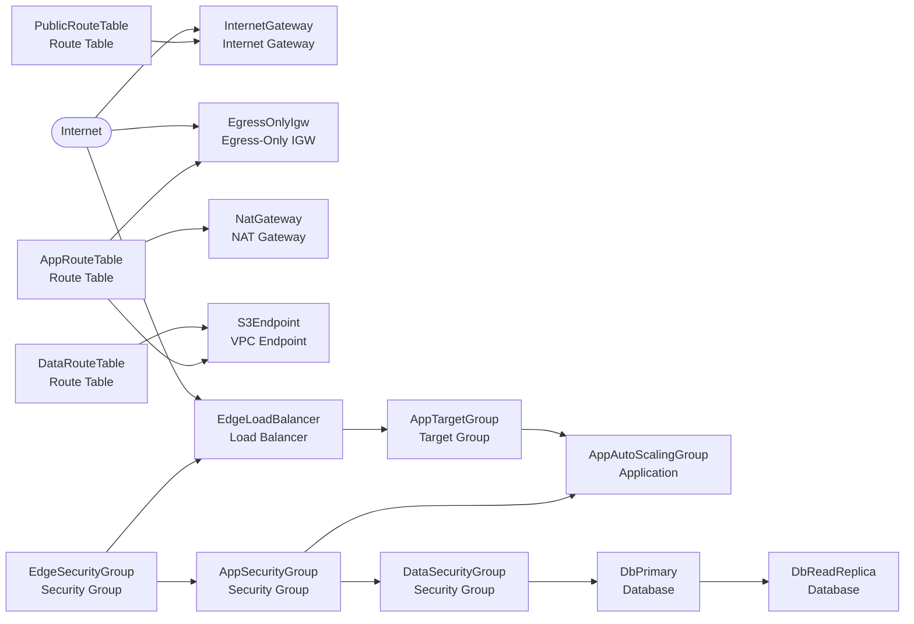

# Vpc Baseline — Architecture

Generated from [`template.yaml`](template.yaml) by [`scripts/generate-architecture.py`](../../scripts/generate-architecture.py). Do not edit by hand.

This performs lightweight dependency discovery rather than implementing a CloudFormation evaluator. CloudFormation already understands CloudFormation; the diagram only needs to know what leans on what.

52 resources in the template.
